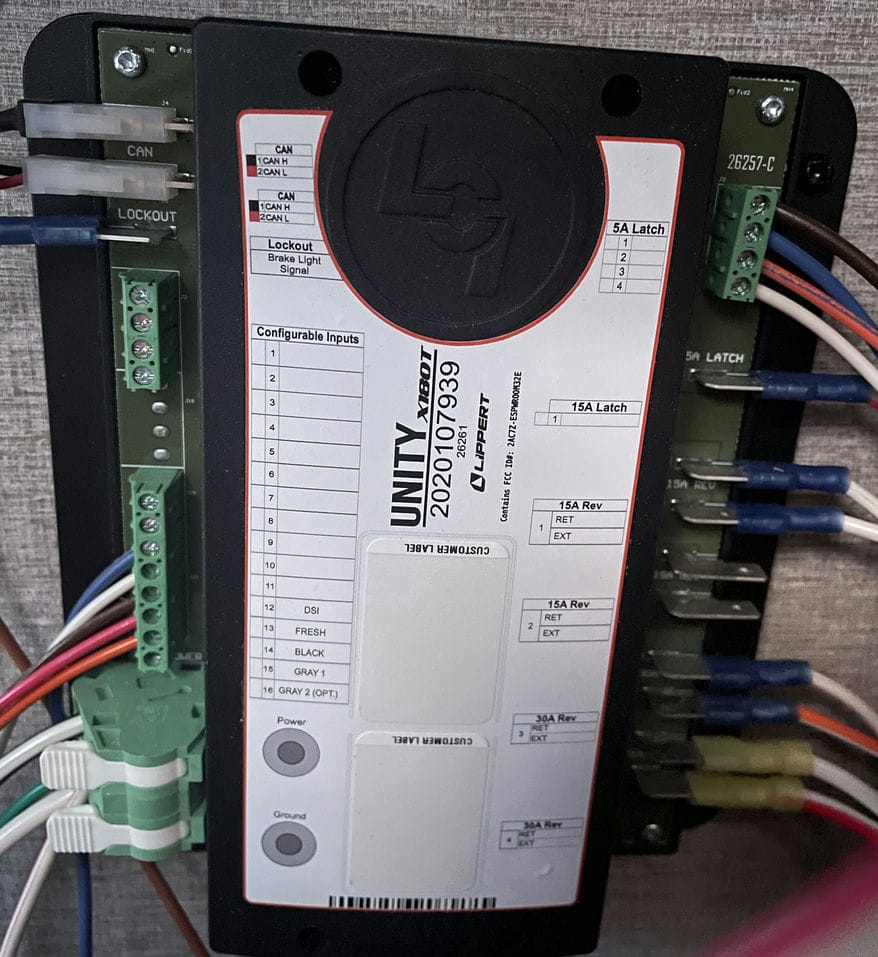

# Let's hack this trailer...
When I say, [hack](https://www.urbandictionary.com/define.php?term=hack) it is in old school sense of of the work, not the malicious sense.

## Frame the Problem
There are some people out there who are connecting the RV or Trailer over Ethernet and WiFi.  Other are plugging in via CANBUS.  So my problem is that I have a Grand Design 2022 Imagine 2670MK.  It does not use or have a Wi-Fi module.  It uses a bluetooth App [OneControl](https://store.lci1.com/onecontrol) to connect to the [Lippert Unity X180T](https://store.lci1.com/unity-x180t-hd-assembly-2020107939) Unity controller.  When I get a log from the Canbus have plugging into the back of the display panel it does not come back as RV-C.  The goal is to put Home-Assistant into my trailer, get better display results onto a Amazon Fire Tablet and add in all the other devices like the Furrion DV7200 Stereo, Samsung Soundbar, Furrion Fireplace, Refridgator tempature sensor, TCL TV, Battery measures, Propane levels, light switches and additionally light controls. ... _because I can_.



Sidenote: Who would use CAN Hi as Black and CAN Lo as Red...

### Project references:
- https://github.com/linuxkidd/coachproxy-os Open Source version of CoachProxy software
- https://github.com/rperciaccante/HomeAssistant_OneControl_Discovery A set of Node Red flows to control a Lippert OneControl system from Home Assistant
- https://github.com/spbrogan/ha_addon_rvc2mqtt Home Assistant addon for rvc2mqtt
- https://github.com/c3re/can2mqtt Bidirectional CAN-Bus to MQTT-Bridge


Run with a RV-C project, really nice one by Sean Brogan @spbrogan https://github.com/spbrogan/rvc2mqtt  It is based on the RC-V spec and using very nice YAML driving parser to form the packets.

But that does not product proper DGN (Diagnostic Group Number) codes which should match against the RV-C spec.

What I do see is that the `arbitration_id` matches the `dgn` + `source_id` and the priority is always 0


So what does that tell me...
```
    CanID = bin(arbitration_id)[2:].zfill(
            29
        )  # make base two string and zfill to 29 bits
        Priority = format(int(CanID[0:3], 2), "01X")
        DgnH = format(int(CanID[4:13], 2), "03X")
        DgnL = format(int(CanID[13:21], 2), "02X")
        Dgn = DgnH + DgnL
        SrcID = format(int(CanID[21:29], 2), "02X")
```
Which makes sense since they are the same bits from the same frame.  Sample below.  In my [sampling](can-bus-code-sampling1.xlsx) there where 83 repeated frames

So it is not RV-C, then does it as last use a custom arbitration_id with a common way to represent the data?

Let's study the data, the following values :
- `0x701` is the heartbeat or clock since there is a unique 83 values
- `0x3e3` is also special, in that it has 164 values with only a few repeating many time 80 for `0xC0FF00000000`

It looks to be CANopen based.

Predefined Connection Set
For simple network structures, CANopen supports a predefined allocation of message identifiers.

###### [Wikipedia Table](https://en.wikipedia.org/wiki/CANopen#Predefined_Connection_Set.5B7.5D)

###### Abridged Table:

| Name            | COB ID Range |
|-----------------|--------------|
| SYNC            | 080          |
| EMCY            | 080 + NodeID |
| TPDO1           | 180 + NodeID |
| RPDO1           | 200 + NodeID |
| TPDO2           | 280 + NodeID |
| RPDO2           | 300 + NodeID |
| TPDO3           | 380 + NodeID |
| RPDO3           | 400 + NodeID |
| TPDO4           | 480 + NodeID |
| RPDO4           | 500 + NodeID |
| TSDO            | 580 + NodeID |
| RSDO            | 600 + NodeID |
| NMT (Heartbeat) | 700 + NodeID |

- arbitration-id is the COB-ID
- when the DGN is 0 then all the devices are giving their status, the source_id is the device type

Okay, it is forsure not RV-C.  It is CANOpen

let try 
- [candump](https://manpages.debian.org/testing/can-utils/candump.1.en.html)
- https://github.com/oresat/CANopen-monitor#readme

`candump -td -l`

Circle back to HA... 
- https://esphome.io/components/canbus.html
- hmmmm https://esphome.io/components/canbus.html#mcp2515-component 

```
 log2asc -I candump-2023-04-23_205750.log  -4 can0 |more
date Sun Apr 23 20:57:50 2023
base hex  timestamps absolute
no internal events logged
   0.0000 1  685             Rx   d 1 00
   0.0004 1  85              Rx   d 8 00 14 00 00 00 1A E8 76
   0.0007 1  185             Rx   d 4 00 00 00 00
   0.0012 1  285             Rx   d 8 00 A2 85 2B 00 44 12 01
   0.0373 1  32C             Rx   d 6 80 FF 00 01 00 00
```
---
```
  |       |  |               |      | | Data Bytes (hex) 
  |       |  |               |      | Data Length Code
  |       |  |               | Type
  |       |  | ID (hex)
  |       | Bus
  | Time Offset (sec)
```


# Moving on to CanOpen
[We are done here](itisCanOpen-custom.md)

---

---
# Appendix

Under RV-C
These ones repeat more than 83 times.
|arbitration_id|count|
|---|---|
| 0x37d | 257 |
| 0x368	| 207 |
| 0x3e3	| 164 |
| 0x35c	| 141 |

The following are the arbitation_id
```
0x1
0x1a
0x2c
0x2f
0x31
0x40
0x5c
0x67
0x68
0x7d
0x85
0xa1
0xac
0xc9
0xd0
0xe3
0x101
0x11a
0x12c
0x12f
0x131
0x140
0x15c
0x167
0x168
0x17d
0x185
0x1a1
0x1ac
0x1c9
0x1d0
0x1e3
0x201
0x21a
0x22c
0x22f
0x231
0x240
0x25c
0x267
0x268
0x27d
0x285
0x2a1
0x2ac
0x2c9
0x2d0
0x2e3
0x301
0x31a
0x32c
0x32f
0x331
0x340
0x35c
0x367
0x368
0x37d
0x385
0x3a1
0x3ac
0x3c9
0x3d0
0x3e3
0x601
0x62c
0x685
0x701   - Diagnostic Message
0x1718511
0x2145c11
```

Dump of rvc2mqtt
```
2023-04-23 01:55:51 Msg {'arbitration_id': '0x101', 'data': '00000000', 'priority': '0', 'dgn_h': '000', 'dgn_l': '01', 'dgn': '00001', 'source_id': '01', 'name': 'UNKNOWN-00001'}
2023-04-23 01:55:51 Msg {'arbitration_id': '0x201', 'data': '00B8012400000100', 'priority': '0', 'dgn_h': '000', 'dgn_l': '02', 'dgn': '00002', 'source_id': '01', 'name': 'UNKNOWN-00002'}
2023-04-23 01:55:51 Msg {'arbitration_id': '0x701', 'data': '0008272FFFFF0000', 'priority': '0', 'dgn_h': '000', 'dgn_l': '07', 'dgn': '00007', 'source_id': '01', 'name': 'UNKNOWN-00007'}
2023-04-23 01:55:51 Msg {'arbitration_id': '0x3ac', 'data': 'C0FF00000000', 'priority': '0', 'dgn_h': '000', 'dgn_l': '03', 'dgn': '00003', 'source_id': 'AC', 'name': 'UNKNOWN-00003'}
2023-04-23 01:55:51 Msg {'arbitration_id': '0x385', 'data': '00', 'priority': '0', 'dgn_h': '000', 'dgn_l': '03', 'dgn': '00003', 'source_id': '85', 'name': 'UNKNOWN-00003'}
2023-04-23 01:55:51 Msg {'arbitration_id': '0x2145c11', 'data': '002B', 'priority': '0', 'dgn_h': '014', 'dgn_l': '5C', 'dgn': '0145C', 'source_id': '11', 'name': 'UNKNOWN-0145C'}
2023-04-23 01:55:51 Msg {'arbitration_id': '0x1718511', 'data': '002B0D7207', 'priority': '0', 'dgn_h': '171', 'dgn_l': '85', 'dgn': '17185', 'source_id': '11', 'name': 'UNKNOWN-17185'}
2023-04-23 01:55:51 Msg {'arbitration_id': '0x3e3', 'data': 'C0FF00000000', 'priority': '0', 'dgn_h': '000', 'dgn_l': '03', 'dgn': '00003', 'source_id': 'E3', 'name': 'UNKNOWN-00003'}
2023-04-23 01:55:51 Msg {'arbitration_id': '0x35c', 'data': '80FF00010000', 'priority': '0', 'dgn_h': '000', 'dgn_l': '03', 'dgn': '00003', 'source_id': '5C', 'name': 'UNKNOWN-00003'}
2023-04-23 01:55:51 Msg {'arbitration_id': '0x368', 'data': '81FF018D0000', 'priority': '0', 'dgn_h': '000', 'dgn_l': '03', 'dgn': '00003', 'source_id': '68', 'name': 'UNKNOWN-00003'}
2023-04-23 01:55:51 Msg {'arbitration_id': '0x37d', 'data': '80FF00230000', 'priority': '0', 'dgn_h': '000', 'dgn_l': '03', 'dgn': '00003', 'source_id': '7D', 'name': 'UNKNOWN-00003'}
2023-04-23 01:55:51 Msg {'arbitration_id': '0x301', 'data': '0041', 'priority': '0', 'dgn_h': '000', 'dgn_l': '03', 'dgn': '00003', 'source_id': '01', 'name': 'UNKNOWN-00003'}
2023-04-23 01:55:51 Msg {'arbitration_id': '0x32c', 'data': '80FF00010000', 'priority': '0', 'dgn_h': '000', 'dgn_l': '03', 'dgn': '00003', 'source_id': '2C', 'name': 'UNKNOWN-00003'}
2023-04-23 01:55:51 Msg {'arbitration_id': '0x31a', 'data': 'C0FF00000000', 'priority': '0', 'dgn_h': '000', 'dgn_l': '03', 'dgn': '00003', 'source_id': '1A', 'name': 'UNKNOWN-00003'}
2023-04-23 01:55:51 Msg {'arbitration_id': '0x340', 'data': '80FF00010000', 'priority': '0', 'dgn_h': '000', 'dgn_l': '03', 'dgn': '00003', 'source_id': '40', 'name': 'UNKNOWN-00003'}
2023-04-23 01:55:51 Msg {'arbitration_id': '0x368', 'data': '81FF018E0000', 'priority': '0', 'dgn_h': '000', 'dgn_l': '03', 'dgn': '00003', 'source_id': '68', 'name': 'UNKNOWN-00003'}
2023-04-23 01:55:51 Msg {'arbitration_id': '0x3d0', 'data': '00', 'priority': '0', 'dgn_h': '000', 'dgn_l': '03', 'dgn': '00003', 'source_id': 'D0', 'name': 'UNKNOWN-00003'}
2023-04-23 01:55:51 Msg {'arbitration_id': '0x32f', 'data': '00', 'priority': '0', 'dgn_h': '000', 'dgn_l': '03', 'dgn': '00003', 'source_id': '2F', 'name': 'UNKNOWN-00003'}
2023-04-23 01:55:51 Msg {'arbitration_id': '0x331', 'data': '00', 'priority': '0', 'dgn_h': '000', 'dgn_l': '03', 'dgn': '00003', 'source_id': '31', 'name': 'UNKNOWN-00003'}
2023-04-23 01:55:51 Msg {'arbitration_id': '0x367', 'data': 'C0FF00000000', 'priority': '0', 'dgn_h': '000', 'dgn_l': '03', 'dgn': '00003', 'source_id': '67', 'name': 'UNKNOWN-00003'}
2023-04-23 01:55:51 Msg {'arbitration_id': '0x3a1', 'data': '00', 'priority': '0', 'dgn_h': '000', 'dgn_l': '03', 'dgn': '00003', 'source_id': 'A1', 'name': 'UNKNOWN-00003'}
2023-04-23 01:55:51 Msg {'arbitration_id': '0x3c9', 'data': '00', 'priority': '0', 'dgn_h': '000', 'dgn_l': '03', 'dgn': '00003', 'source_id': 'C9', 'name': 'UNKNOWN-00003'}
2023-04-23 01:55:51 Msg {'arbitration_id': '0x37d', 'data': '80FF00240000', 'priority': '0', 'dgn_h': '000', 'dgn_l': '03', 'dgn': '00003', 'source_id': '7D', 'name': 'UNKNOWN-00003'}
2023-04-23 01:55:51 Msg {'arbitration_id': '0x62c', 'data': '00', 'priority': '0', 'dgn_h': '000', 'dgn_l': '06', 'dgn': '00006', 'source_id': '2C', 'name': 'UNKNOWN-00006'}
2023-04-23 01:55:51 Msg {'arbitration_id': '0x67', 'data': '02140000001B3004', 'priority': '0', 'dgn_h': '000', 'dgn_l': '00', 'dgn': '00000', 'source_id': '67', 'name': 'UNKNOWN-00000'}
2023-04-23 01:55:51 Msg {'arbitration_id': '0xac', 'data': '02140000001B3004', 'priority': '0', 'dgn_h': '000', 'dgn_l': '00', 'dgn': '00000', 'source_id': 'AC', 'name': 'UNKNOWN-00000'}
2023-04-23 01:55:51 Msg {'arbitration_id': '0x1a', 'data': '02140000001B3004', 'priority': '0', 'dgn_h': '000', 'dgn_l': '00', 'dgn': '00000', 'source_id': '1A', 'name': 'UNKNOWN-00000'}
2023-04-23 01:55:51 Msg {'arbitration_id': '0x68', 'data': '02140000001B3004', 'priority': '0', 'dgn_h': '000', 'dgn_l': '00', 'dgn': '00000', 'source_id': '68', 'name': 'UNKNOWN-00000'}
2023-04-23 01:55:51 Msg {'arbitration_id': '0x5c', 'data': '02140000001B3004', 'priority': '0', 'dgn_h': '000', 'dgn_l': '00', 'dgn': '00000', 'source_id': '5C', 'name': 'UNKNOWN-00000'}
2023-04-23 01:55:51 Msg {'arbitration_id': '0x2c', 'data': '02140000001B3004', 'priority': '0', 'dgn_h': '000', 'dgn_l': '00', 'dgn': '00000', 'source_id': '2C', 'name': 'UNKNOWN-00000'}
2023-04-23 01:55:51 Msg {'arbitration_id': '0x40', 'data': '02140000001B3004', 'priority': '0', 'dgn_h': '000', 'dgn_l': '00', 'dgn': '00000', 'source_id': '40', 'name': 'UNKNOWN-00000'}
2023-04-23 01:55:51 Msg {'arbitration_id': '0xe3', 'data': '02140000001B3004', 'priority': '0', 'dgn_h': '000', 'dgn_l': '00', 'dgn': '00000', 'source_id': 'E3', 'name': 'UNKNOWN-00000'}
2023-04-23 01:55:51 Msg {'arbitration_id': '0x7d', 'data': '02140000001B3004', 'priority': '0', 'dgn_h': '000', 'dgn_l': '00', 'dgn': '00000', 'source_id': '7D', 'name': 'UNKNOWN-00000'}
2023-04-23 01:55:51 Msg {'arbitration_id': '0xc9', 'data': '02140000001B3004', 'priority': '0', 'dgn_h': '000', 'dgn_l': '00', 'dgn': '00000', 'source_id': 'C9', 'name': 'UNKNOWN-00000'}
2023-04-23 01:55:51 Msg {'arbitration_id': '0xa1', 'data': '02140000001B3004', 'priority': '0', 'dgn_h': '000', 'dgn_l': '00', 'dgn': '00000', 'source_id': 'A1', 'name': 'UNKNOWN-00000'}
2023-04-23 01:55:51 Msg {'arbitration_id': '0x31', 'data': '02140000001B3004', 'priority': '0', 'dgn_h': '000', 'dgn_l': '00', 'dgn': '00000', 'source_id': '31', 'name': 'UNKNOWN-00000'}
2023-04-23 01:55:51 Msg {'arbitration_id': '0xd0', 'data': '02140000001B3004', 'priority': '0', 'dgn_h': '000', 'dgn_l': '00', 'dgn': '00000', 'source_id': 'D0', 'name': 'UNKNOWN-00000'}
2023-04-23 01:55:51 Msg {'arbitration_id': '0x2f', 'data': '02140000001B3004', 'priority': '0', 'dgn_h': '000', 'dgn_l': '00', 'dgn': '00000', 'source_id': '2F', 'name': 'UNKNOWN-00000'}
```


