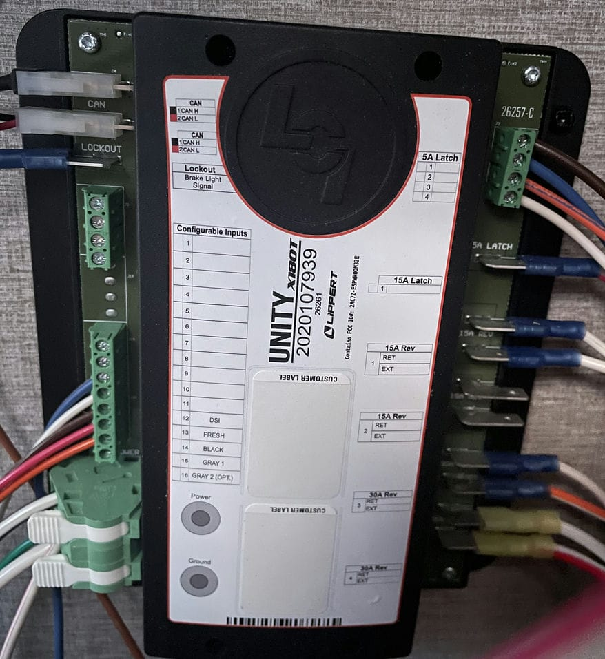

# lippert-canbus
Figure out the way in which Grand Design Trailers work using CAN bus (which using Lippert controllers)

# Let's hack this trailer...
When I say, [hack](https://www.urbandictionary.com/define.php?term=hack) it is in old school sense of of the work, not the malicious sense.

## Frame the Problem
There are some people out there who are connecting the RV or Trailer over Ethernet and WiFi.  Other are plugging in via CANBUS.  So my problem is that I have a Grand Design 2022 Imagine 2670MK.  It does not use or have a Wi-Fi module.  It uses a bluetooth App [OneControl](https://store.lci1.com/onecontrol) to connect to the [Lippert Unity X180T](https://store.lci1.com/unity-x180t-hd-assembly-2020107939) Unity controller.  When I get a log from the Canbus have plugging into the back of the display panel it does not come back as RV-C.  The goal is to put Home-Assistant into my trailer, get better display results onto a Amazon Fire Tablet and add in all the other devices like the Furrion DV7200 Stereo, Samsung Soundbar, Furrion Fireplace, Refridgator tempature sensor, TCL TV, Battery measures, Propane levels, light switches and additionally light controls. ... _because I can_.

- [Is it RV-C](IsItRV-C.md)
- [It is CanOpen?](itisCanOpen-custom.md)
    - Suprise it is something else ... a total custom